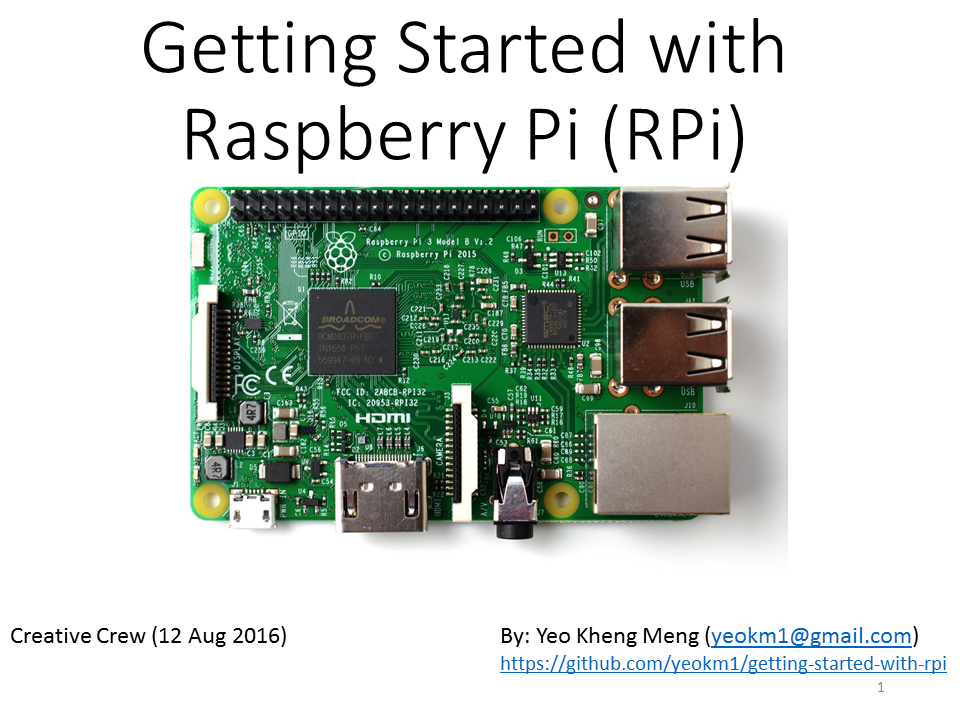
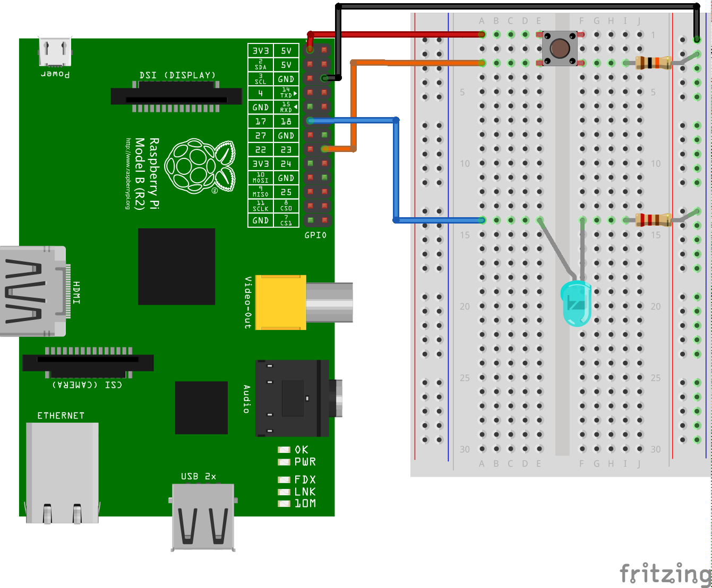

# getting-started-with-rpi
A talk about introducing the audience to setting up the Raspberry Pi as well as basic Python coding on the GPIO pins.

#Video of my talk

#Slides on Slideshare
(Click the picture link to access the slides)

#Hardware Connection:

